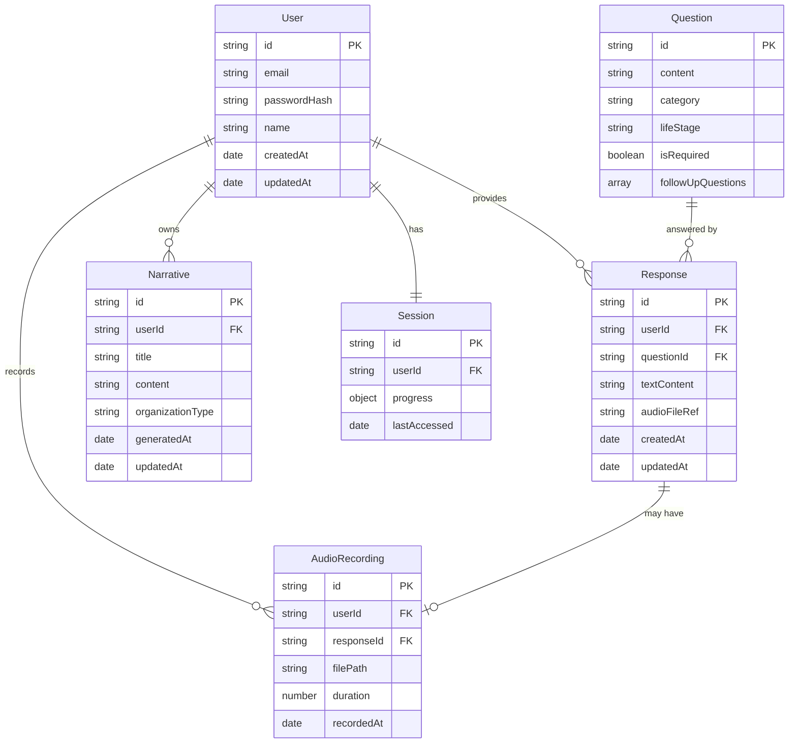

# Autobiographer: Technical Architecture Document

**Date:** May 1, 2025  
**Version:** 1.0

This document outlines the technical architecture of the Autobiographer application, detailing the system components, data flow, and technology choices.

## 1. System Architecture Overview

The Autobiographer application will follow a modern web application architecture with a clear separation between frontend and backend components, as illustrated below:

```mermaid
flowchart TD
    subgraph Client
        Frontend["React Frontend"]
        style Frontend fill:#f9f,stroke:#333,stroke-width:2px
    end
    
    subgraph Server
        Backend["Node.js/Express Backend"]
        style Backend fill:#bbf,stroke:#333,stroke-width:2px
    end
    
    subgraph "Data Storage"
        DB["Database Layer"]
        Storage["File Storage"]
        style DB fill:#bfb,stroke:#333,stroke-width:2px
        style Storage fill:#fbb,stroke:#333,stroke-width:2px
    end
    
    Frontend <--> Backend
    Backend --> DB
    DB --> Storage
    
    classDef container fill:#fff,stroke:#333,stroke-width:1px;
    class Client,Server,"Data Storage" container;
```

## 2. Frontend Architecture

### 2.1 Technologies
- **Framework**: React.js
- **State Management**: Redux or Context API
- **UI Components**: Material-UI or Chakra UI
- **Routing**: React Router
- **Form Handling**: Formik or React Hook Form
- **API Communication**: Axios or Fetch API

### 2.2 Key Components
- **Authentication Components**: Login, registration, password reset
- **Question Navigator**: Interface for browsing and selecting questions
- **Response Editor**: Rich text editor for text responses
- **Voice Recorder**: Component for capturing audio and displaying real-time transcription
- **Narrative Viewer**: Component for displaying and editing generated narratives
- **Export Manager**: Interface for selecting and triggering exports

### 2.3 Offline Support
- Service Workers for offline functionality
- IndexedDB for local data storage
- Synchronization logic for reconciling offline changes

## 3. Backend Architecture

### 3.1 Technologies
- **Server Framework**: Node.js with Express
- **Authentication**: Passport.js or custom JWT implementation
- **API Documentation**: Swagger/OpenAPI
- **Validation**: Joi or Yup
- **Logging**: Winston or Pino

### 3.2 API Structure
- RESTful API endpoints organized by resource
- GraphQL API for complex data requirements (optional)
- WebSocket connections for real-time features

### 3.3 Key Services
- **Authentication Service**: User registration, login, and session management
- **Question Service**: Retrieval and management of questions
- **Response Service**: Storage and retrieval of user responses
- **Narrative Service**: Generation and management of narratives
- **Export Service**: Generation of formatted exports
- **Storage Service**: Management of file uploads and retrievals

## 4. Data Layer

### 4.1 Database
- **Primary Database**: MongoDB (document-based) or PostgreSQL (relational)
- **Caching Layer**: Redis for performance optimization

### 4.2 Key Data Models

The following diagram illustrates the key data models and their relationships:



### 4.3 File Storage
- **Audio Files**: Original voice recordings
- **Export Files**: Generated narrative documents
- **Backup Files**: System and user-initiated backups

## 5. Speech-to-Text Implementation

### 5.1 Technologies
- **Core Engine**: OpenAI Whisper (local deployment) or Mozilla DeepSpeech
- **Audio Processing**: Web Audio API (frontend) and Node.js audio libraries (backend)

### 5.2 Architecture Options

The following diagrams illustrate the different speech-to-text implementation approaches:

```mermaid
flowchart TD
    subgraph "Option A: Client-Side Processing"
        A1[User speaks] --> A2[Browser records audio]
        A2 --> A3[Local AI model processes audio]
        A3 --> A4[Text displayed in browser]
        A4 --> A5[Text sent to server]
        A5 --> A6[Audio file sent to server]
        
        style A1 fill:#f9f,stroke:#333,stroke-width:1px
        style A2 fill:#f9f,stroke:#333,stroke-width:1px
        style A3 fill:#f9f,stroke:#333,stroke-width:1px
        style A4 fill:#f9f,stroke:#333,stroke-width:1px
        style A5 fill:#bbf,stroke:#333,stroke-width:1px
        style A6 fill:#bbf,stroke:#333,stroke-width:1px
    end
    
    subgraph "Option B: Server-Side Processing"
        B1[User speaks] --> B2[Browser records audio]
        B2 --> B3[Audio streamed to server]
        B3 --> B4[Server AI model processes audio]
        B4 --> B5[Text returned to browser]
        B4 --> B6[Text saved in database]
        B3 --> B7[Audio file saved]
        
        style B1 fill:#f9f,stroke:#333,stroke-width:1px
        style B2 fill:#f9f,stroke:#333,stroke-width:1px
        style B3 fill:#bbf,stroke:#333,stroke-width:1px
        style B4 fill:#bbf,stroke:#333,stroke-width:1px
        style B5 fill:#f9f,stroke:#333,stroke-width:1px
        style B6 fill:#bfb,stroke:#333,stroke-width:1px
        style B7 fill:#fbb,stroke:#333,stroke-width:1px
    end
    
    subgraph "Option C: Hybrid Approach"
        C1[User speaks] --> C2[Browser records audio]
        C2 --> C3[Basic processing in browser]
        C3 --> C4[Initial text displayed]
        C2 --> C5[Audio sent to server]
        C5 --> C6[Advanced processing on server]
        C6 --> C7[Improved text returned]
        C6 --> C8[Final text saved]
        C5 --> C9[Audio file saved]
        
        style C1 fill:#f9f,stroke:#333,stroke-width:1px
        style C2 fill:#f9f,stroke:#333,stroke-width:1px
        style C3 fill:#f9f,stroke:#333,stroke-width:1px
        style C4 fill:#f9f,stroke:#333,stroke-width:1px
        style C5 fill:#bbf,stroke:#333,stroke-width:1px
        style C6 fill:#bbf,stroke:#333,stroke-width:1px
        style C7 fill:#f9f,stroke:#333,stroke-width:1px
        style C8 fill:#bfb,stroke:#333,stroke-width:1px
        style C9 fill:#fbb,stroke:#333,stroke-width:1px
    end
    
    classDef clientSide fill:#f9f,stroke:#333,stroke-width:1px;
    classDef serverSide fill:#bbf,stroke:#333,stroke-width:1px;
    classDef database fill:#bfb,stroke:#333,stroke-width:1px;
    classDef fileStorage fill:#fbb,stroke:#333,stroke-width:1px;
```



- **Option A: Client-Side Processing**
  - Speech recognition runs in the browser
  - Reduced server load, works offline
  - May have performance limitations on less powerful devices

- **Option B: Server-Side Processing**
  - Audio streamed to server for processing
  - More consistent performance across devices
  - Requires constant network connection

- **Option C: Hybrid Approach**
  - Basic processing in browser
  - Complex processing on server
  - Graceful degradation when offline

## 6. Narrative Generation System

### 6.1 Technologies
- **Natural Language Processing**: Local models or API-based services
- **Template Engine**: Handlebars, EJS, or custom solution

### 6.2 Architecture
- Rule-based text transformation
- Template-based narrative structure
- NLP for sentence fluency and coherence
- Entity recognition for contextual connections

## 7. Security Architecture

### 7.1 Authentication & Authorization
- JWT-based authentication
- Role-based access control
- Multi-factor authentication (optional)

### 7.2 Data Protection
- Encryption at rest for sensitive data
- Secure transmission (HTTPS)
- Data anonymization for non-essential PII

### 7.3 Infrastructure Security
- Regular security audits
- Input validation and sanitization
- Protection against common web vulnerabilities

## 8. Scalability Considerations

### 8.1 Horizontal Scaling
- Stateless API design for load balancing
- Microservices architecture for independent scaling

### 8.2 Performance Optimization
- CDN for static assets
- Caching strategies
- Lazy loading of resources

## 9. Mobile Expansion Architecture

### 9.1 Approach Options
- **Option A: Progressive Web App (PWA)**
  - Enhanced web experience with offline capabilities
  - Lower development effort
  - Some platform limitations

- **Option B: React Native**
  - Shared codebase with web version
  - Native performance and features
  - Higher development complexity

- **Option C: Native iOS/Android Apps**
  - Optimized for each platform
  - Maximum performance and capabilities
  - Highest development effort

### 9.2 Shared Backend
- Same API endpoints for web and mobile
- Mobile-specific optimizations
- Authentication and sync protocols

## 10. Development & Deployment Pipeline

### 10.1 Development Environment
- Git workflow with feature branches
- Dev, staging, and production environments
- Automated testing (unit, integration, E2E)

### 10.2 CI/CD Pipeline
- Automated builds and tests
- Containerization with Docker
- Deployment automation

### 10.3 Monitoring & Maintenance
- Application performance monitoring
- Error tracking and reporting
- Usage analytics